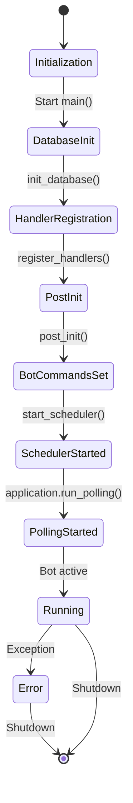
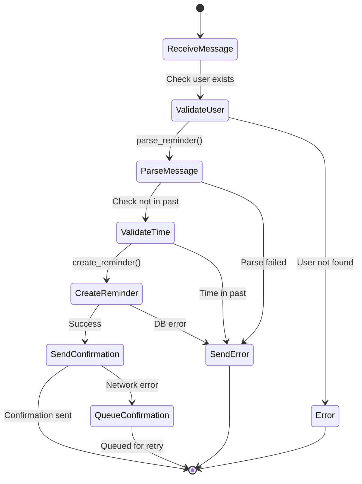
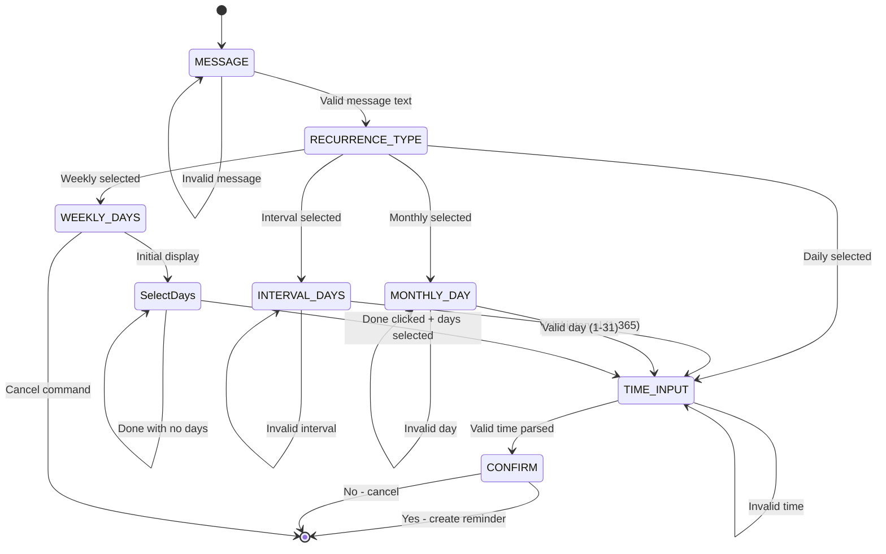
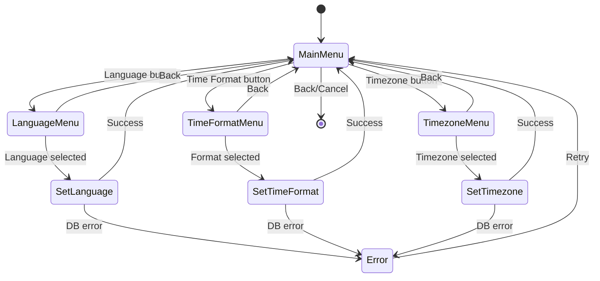
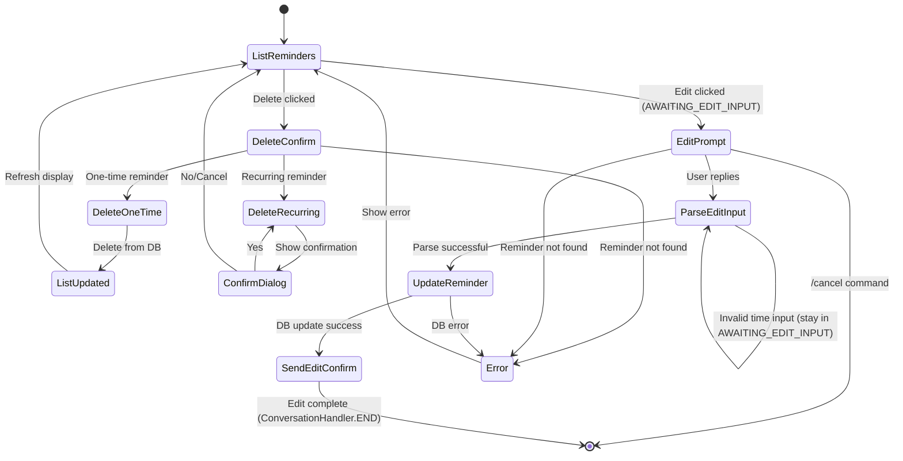
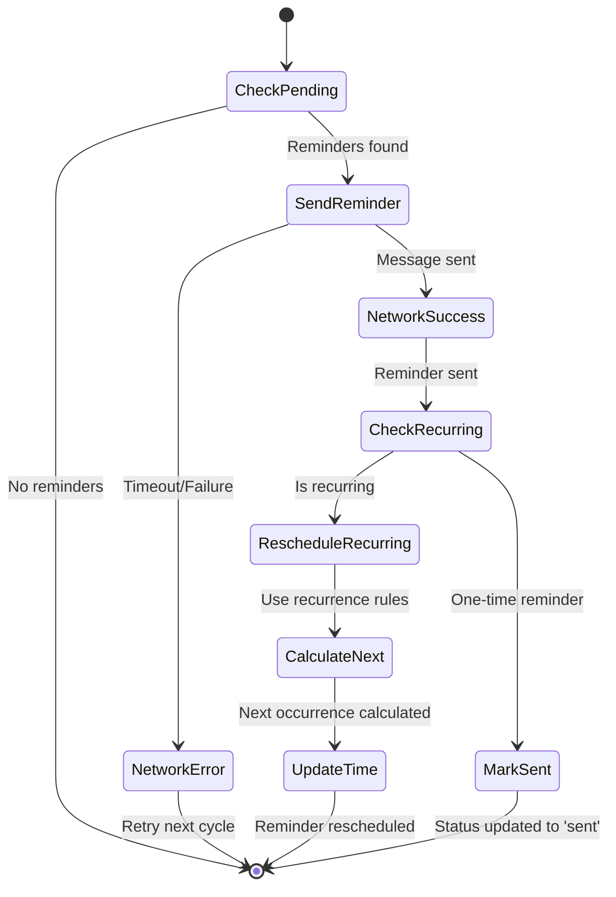
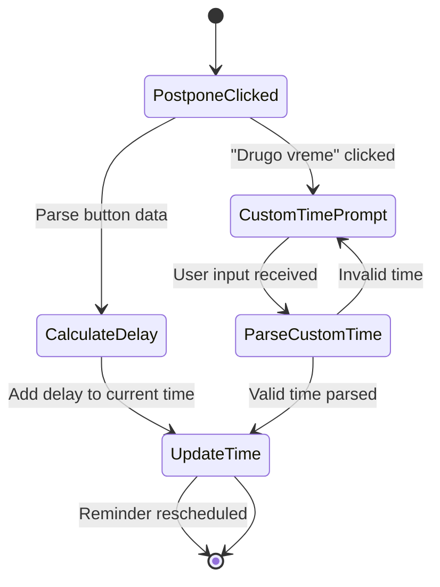
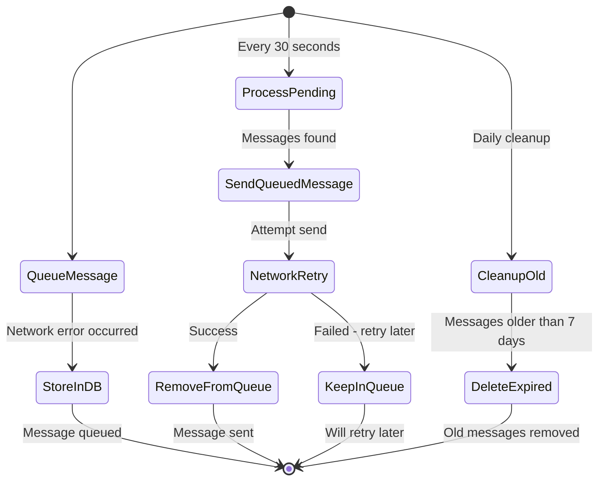
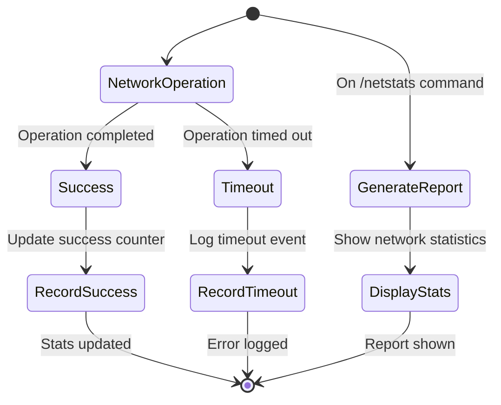
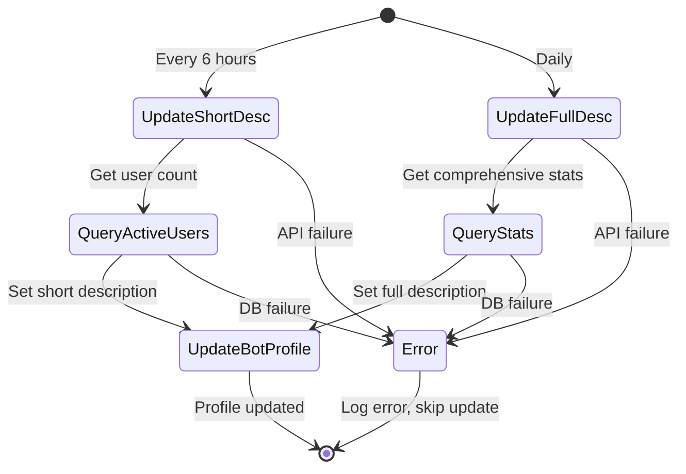

# Kosmos Telegram Bot State Machines

This document describes the state machines for the main components of the Kosmos Telegram Bot system.

## 1. Main Application State Machine

**States:**
- **Initialization**: Bot startup process begins
- **DatabaseInit**: Database connection and schema setup
- **HandlerRegistration**: Registering command and message handlers
- **PostInit**: Setting bot commands and updating descriptions
- **BotCommandsSet**: Telegram UI commands configured
- **SchedulerStarted**: Background reminder scheduler running
- **PollingStarted**: Telegram update polling active
- **Running**: Bot fully operational
- **Error**: Critical error state

## 2. Reminder Creation State Machine

**States:**
- **ReceiveMessage**: Text message received from user
- **ValidateUser**: Verify user exists in database
- **ParseMessage**: Extract reminder text and time using time parser
- **ValidateTime**: Ensure scheduled time is in the future
- **CreateReminder**: Store reminder in database
- **SendConfirmation**: Send success message to user
- **QueueConfirmation**: Queue confirmation for retry on network error

## 3. Recurring Reminder Creation State Machine

**States:**
- **MESSAGE**: Waiting for reminder text input
- **RECURRENCE_TYPE**: Selecting recurrence pattern (daily/interval/weekly/monthly)
- **INTERVAL_DAYS**: Input number of days for interval recurrence
- **WEEKLY_DAYS**: Select which days of week for recurrence
- **MONTHLY_DAY**: Input day of month for monthly recurrence
- **TIME_INPUT**: Input time for the recurring reminder
- **CONFIRM**: Show summary and confirm creation

**Transitions:**
- Each input state loops back on invalid input
- Cancel command can be issued from any state
- Confirmation state allows final yes/no decision

## 4. Settings Configuration State Machine

**States:**
- **MainMenu**: Settings overview with current preferences
- **LanguageMenu**: Language selection (English/Serbian)
- **TimeFormatMenu**: Time format selection (12h/24h)
- **TimezoneMenu**: Timezone selection from predefined list
- **SetLanguage/TimeFormat/Timezone**: Database update operations
- **Error**: Database operation failure

## 5. List/Delete/Edit Operations State Machine

**States:**
- **ListReminders**: Display all pending reminders with action buttons
- **DeleteConfirm**: Initial delete action, check if recurring
- **DeleteOneTime**: Immediate deletion of one-time reminder
- **DeleteRecurring**: Show confirmation dialog for recurring reminders
- **ConfirmDialog**: User confirms/cancels recurring reminder deletion
- **EditPrompt**: Show edit prompt with ForceReply
- **ParseEditInput**: Parse user's edit input (text/time/both)
- **UpdateReminder**: Update reminder in database
- **ListUpdated**: Refresh the reminder list display

**Edit Flow Implementation Details:**
The edit operation uses ConversationHandler with the following state:
- `AWAITING_EDIT_INPUT` (0): Waiting for user's new text/time input

Context data stored during edit:
- `editing_reminder_id`: ID of reminder being edited
- `edit_prompt_message_id`: Message ID of the ForceReply prompt
- `edit_prompt_chat_id`: Chat ID where prompt was sent

Helper function `_cleanup_edit_state()` handles cleanup of context data and deletion of the ForceReply prompt message.

Parse strategies:
1. Time-only input (e.g., "15:00", "tue 10:00") → Updates only time
2. Text + time (e.g., "New text 15:00") → Updates both
3. Text-only (no recognizable time) → Updates only text

Fallback: User can cancel edit with /cancel command

## 6. Reminder Execution State Machine (Scheduler)

**States:**
- **CheckPending**: Query database for due reminders (every minute)
- **SendReminder**: Send notification to user with postpone options
- **NetworkSuccess**: Message delivered successfully
- **NetworkError**: Network timeout or delivery failure
- **CheckRecurring**: Determine if reminder is recurring or one-time
- **RescheduleRecurring**: Handle recurring reminder rescheduling
- **CalculateNext**: Compute next occurrence based on recurrence pattern
- **UpdateTime**: Update reminder's scheduled time in database
- **MarkSent**: Mark one-time reminder as completed

**Recurrence Types:**
- **Daily**: Add 1 day to current time
- **Interval**: Add N days (configurable interval)
- **Weekly**: Find next occurrence from selected weekdays
- **Monthly**: Same day number next month (with overflow handling)

**Timezone Handling:**
Reminders are stored as naive datetime in the user's local timezone. When checking for due reminders:
1. Fetch all pending reminders with user's timezone (via JOIN)
2. For each reminder, get current time in user's timezone
3. Compare scheduled_time with current time in user's timezone
4. Only include reminders where scheduled_time <= now (in user's TZ)

This ensures reminders fire at the correct time regardless of server timezone.

## 7. Postpone Reminder State Machine

**States:**
- **PostponeClicked**: User clicks postpone button in reminder notification
- **CalculateDelay**: Parse button callback data (15m, 30m, 1h, 3h, 1d)
- **UpdateTime**: Update reminder's scheduled time in database
- **CustomTimePrompt**: Show input field for custom postpone time
- **ParseCustomTime**: Parse user's custom time input

## 8. Message Queue State Machine

**States:**
- **QueueMessage**: Original send operation failed due to network error
- **StoreInDB**: Store failed message in message_queue table
- **ProcessPending**: Background job checks for queued messages (every 30 seconds)
- **SendQueuedMessage**: Attempt to send queued message
- **NetworkRetry**: Retry sending over network
- **RemoveFromQueue**: Delete successfully sent message
- **KeepInQueue**: Keep failed message for next retry attempt
- **CleanupOld**: Remove messages older than retention period (max 5 retries)

**Exponential Backoff:**
Messages are retried with increasing delays to prevent API hammering:
- Retry 0: 30 seconds
- Retry 1: 60 seconds (1 minute)
- Retry 2: 120 seconds (2 minutes)
- Retry 3: 300 seconds (5 minutes)
- Retry 4: 600 seconds (10 minutes)

After 5 failed retries, messages are cleaned up during daily cleanup.

## 9. Network Monitoring State Machine

**States:**
- **NetworkOperation**: Any network-dependent operation (send message, etc.)
- **Success**: Operation completed without error
- **Timeout**: Operation failed due to timeout
- **RecordSuccess**: Increment success counter in database
- **RecordTimeout**: Log timeout details for analysis
- **GenerateReport**: User requests network statistics
- **DisplayStats**: Show success/failure rates and recent issues

## 10. Bot Statistics State Machine

**States:**
- **UpdateShortDesc**: Periodic update of bot's short description
- **UpdateFullDesc**: Daily update of bot's full description
- **QueryActiveUsers**: Count active users from database
- **QueryStats**: Gather comprehensive bot usage statistics
- **UpdateBotProfile**: Call Telegram API to update bot profile
- **Error**: Handle API or database failures gracefully</content>
<parameter name="filePath">/var/www/html/kosmos/State_Machine.md